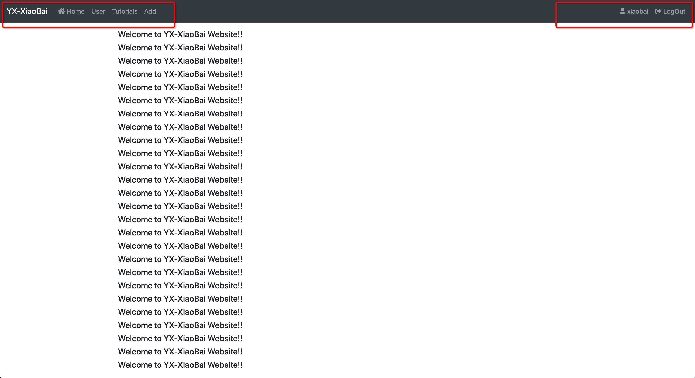
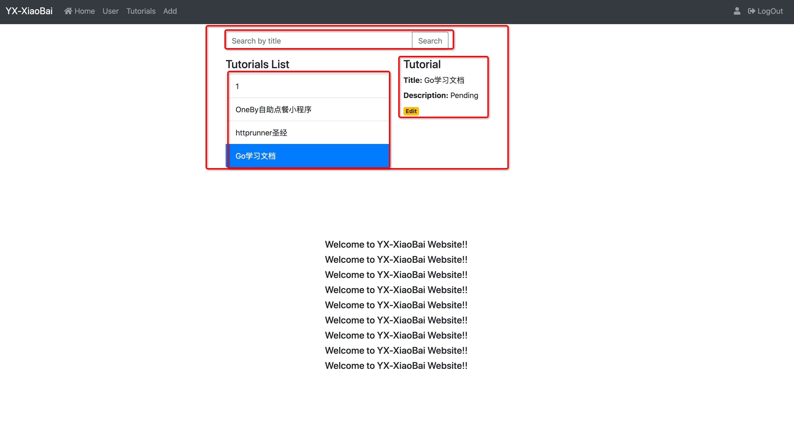
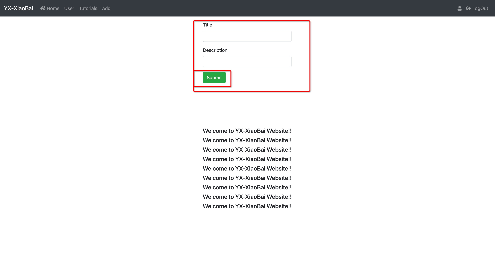

# 书籍管理系统

基于以下技术栈

- 前端(`frontend`)
  - [vue](https://github.com/vuejs/vue) + [js](https://github.com/search?q=js)
- 后端(`backend`)
  - [express](https://github.com/search?q=express) + [ts](https://github.com/search?q=ts)
- 数据库(`database`)
  - [mysql](https://github.com/search?q=mysql)

## Usage

- 分别进入`frontend`、`backend`下载依赖

  - `npm install`

- 分别进入`frontend`、`backend`运行项目

  - frontend: `npm run serve`
  - backend: `npm run dev`

- 项目运行完毕，访问`http://localhost:8081/`即可

## 项目截图

### 登录页

### 首页

### 书籍管理页

### 添加书籍页

